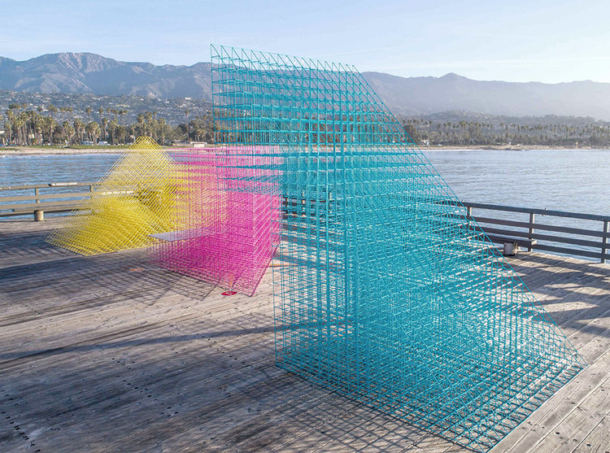

 

#### Language [EN](README.md) | [DE](README_DE.md) Sprache

# 11579 | Grundlagen Digitaler Entwurfsmethoden
Grundlagen Digitaler Entwurfsmethoden

## Thema
Die Aufgabe beinhaltet die Konzeption, den Entwurf und die Entwicklung eines Möbelstücks mit Hilfe digitaler Entwurfsmethoden (Grasshopper für Rhino 3D) und analoger Modelle.